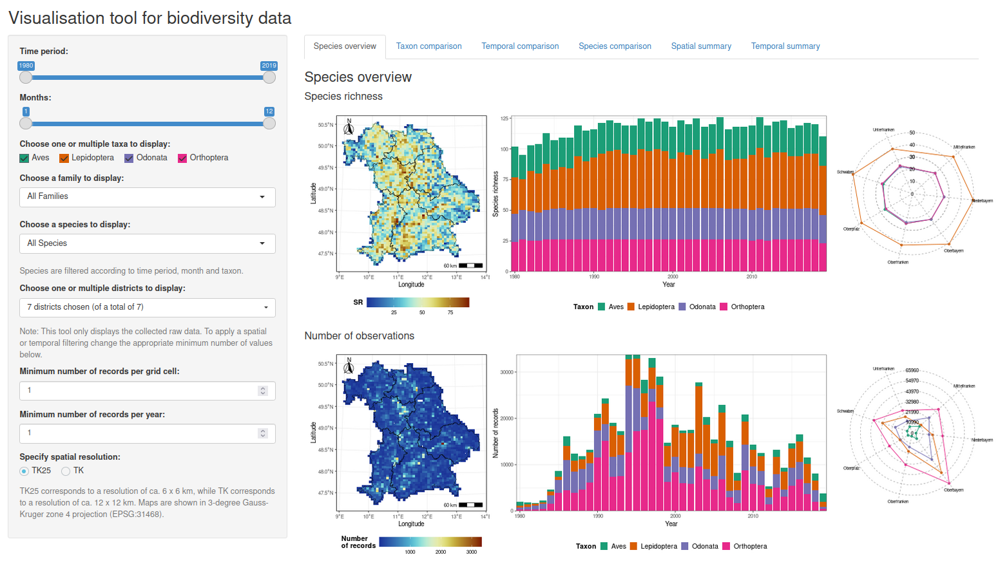

```{r setup, include=FALSE}
knitr::opts_chunk$set(echo = TRUE, fig.align = "center", table.align = "center", warnings = FALSE)
library(knitr)
```

## Overview

You are visiting the github repository of the divViz (Visualisation tool for biodiversity data) package. divViz is a shiny based [web app](https://rs-eco.shinyapps.io/divViz/) supporting interactive exploratory data analysis of simulated biodiversity data.

The main purpose of divViz is:

- Provide a toolbox for researchers to explore species & biodiversity data on the fly

This is what divViz looks like:

```{r, out.width = "90%", fig.align="center", fig.border = "none", eval=T, echo=F}

```

If you are interested to see what divViz has to offer without diving into R, click [here](https://rs-eco.shinyapps.io/divViz/).

## Installation

If you are in for the full treat and want to test divViz from within R, run the following in your R session to install the divViz package from Github:

```{r, eval=FALSE}
if (!require("remotes")) {
  install.packages("remotes")
}
remotes::install_github("RS-eco/divViz")
````

## Load package

Next you will have to load the package

```{r}
library(divViz)
```

## Shiny app

You can now start the divViz Shiny app with:

```{r, eval=FALSE}
library(shiny)
runApp()
```
